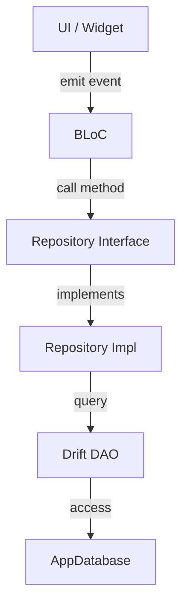
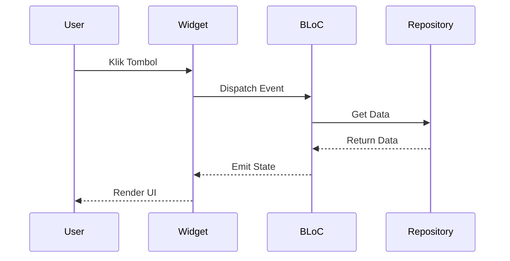
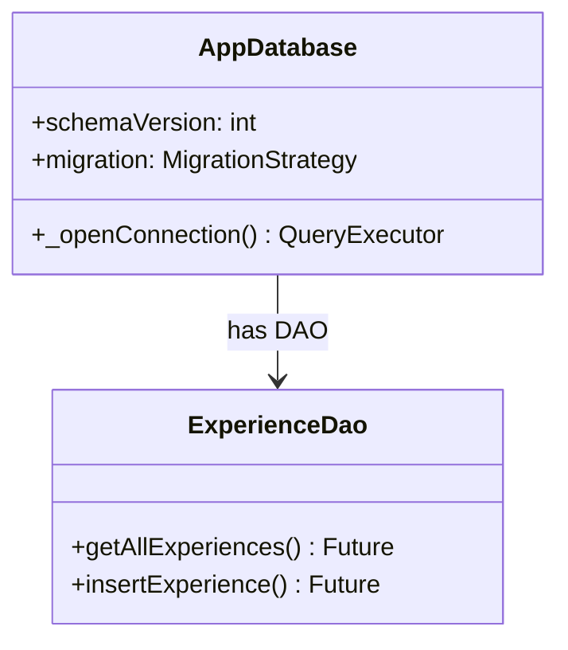
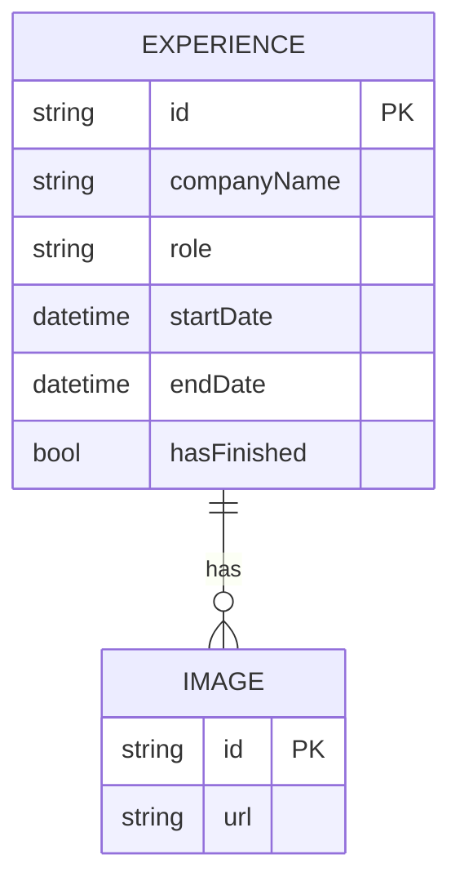
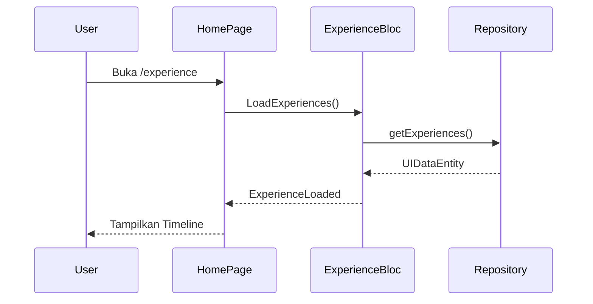
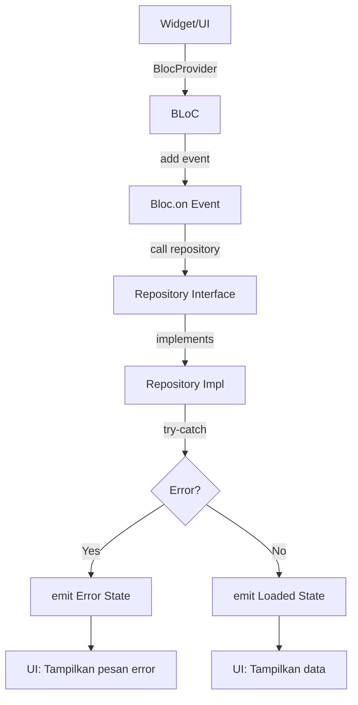

# Mermaid Standards — Standar Diagram Mermaid

## 🎯 Tujuan
Standar penggunaan diagram **Mermaid** untuk dokumentasi di project ini. Mermaid membantu memvisualisasikan arsitektur, alur, dan relasi secara konsisten.

## 📊 Jenis Diagram yang Digunakan

### 1. Flowchart — Alur Proses
Digunakan untuk: Alur data, proses bisnis, flow navigasi.



**Aturan**:
- Gunakan `TD` (top-down) untuk alur proses
- Label edge dengan `-->|label|`
- Node text dalam `[]` atau `()`

### 2. Sequence Diagram — Urutan Interaksi
Digunakan untuk: Interaksi antar komponen, API calls.



**Aturan**:
- Gunakan `participant` dengan alias singkat
- Arrow solid `->>` untuk call, dashed `-->>` untuk return
- Deskripsi interaksi dalam bahasa Indonesia

### 3. Class Diagram — Struktur Class
Digunakan untuk: Arsitektur, pola desain.



### 4. ER Diagram — Entity Relationship
Digunakan untuk: Skema database, relasi tabel.



## 📍 Penempatan Diagram dalam Dokumentasi

### 1. Dokumentasi Arsitektur (`.agents/skills/*/SKILL.md`)
```markdown
## 🔄 Alur Data

```

### 2. Dokumentasi Spesifikasi (`.agents/spec/*.md`)
Gunakan sequence diagram untuk flow user:


## 🚨 Aturan Mermaid
1. **SELALU gunakan sintaks yang valid** — test di [Mermaid Live Editor](https://mermaid.live)
2. **Gunakan label Bahasa Indonesia** untuk deskripsi user-facing
3. **Pisahkan node** dengan baris baru — jangan satu baris panjang
4. **Gunakan alias** untuk panjang: `A[UI / Widget]`
5. **JANGAN gunakan emoji** di dalam diagram (bisa break renderer)
6. **Sesuaikan arah**: `TD` untuk top-down, `LR` untuk left-right
7. **Dokumentasikan dengan diagram** — jangan hanya teks untuk menjelaskan arsitektur

## ✅ Contoh Lengkap — Alur Load Data



Diagram ini digunakan di dokumentasi untuk menjelaskan pola error handling yang konsisten.