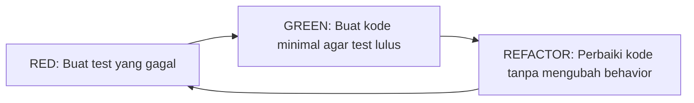

# TDD — Test Driven Development Strategy

## 🎯 Tujuan
Panduan penerapan **Test Driven Development (TDD)** di project ini. TDD memastikan kode yang dihasilkan teruji dan sesuai spesifikasi.

## 🔄 Siklus TDD: Red-Green-Refactor



### 1. RED — Tulis Test yang Gagal
Tulis test terlebih dahulu SEBELUM menulis implementasi.

```dart
// test/unit/repository_test.dart
void main() {
  group('ExperienceRepository', () {
    test('should return experiences when data exists', () async {
      // Arrange
      final mockDao = MockExperienceDao();
      final repository = ExperienceRepositoryImpl(mockDao);

      // Act
      final result = await repository.getExperiences();

      // Assert
      expect(result.isError, false);
      expect(result.data, isNotEmpty);
    });
  });
}
```

### 2. GREEN — Implementasi Minimal
Buat implementasi yang paling sederhana agar test lulus.

```dart
// lib/data/repository/experience_repository_impl.dart
class ExperienceRepositoryImpl implements ExperienceRepository {
  final ExperienceDao _dao;

  @override
  Future<UIDataEntity<List<ExperienceData>>> getExperiences() async {
    try {
      final data = await _dao.getAllExperiences();
      return UIDataEntity(data: data, isError: false);
    } catch (e) {
      return UIDataEntity(isError: true, message: e.toString());
    }
  }
}
```

### 3. REFACTOR — Perbaiki Kode
Perbaiki kode tanpa mengubah behavior eksternal.

```dart
// Refactor: Extract method, rename, optimize
```

## 🧪 Struktur Test TDD

```
test/
├── unit/
│   ├── data/           # Test repository, DAO
│   ├── domain/         # Test model, usecase
│   └── presentation/   # Test BLoC
├── widget/             # Test widget
└── integration/        # Test integrasi
```

## ✅ Aturan TDD di Project Ini
1. **Tulis test SEBELUM implementasi** — bukan setelahnya
2. **Test satu behavior per test** — jangan gabung
3. **Gunakan `group()`** untuk mengelompokkan test case
4. **Mock dependency** eksternal (database, API)
5. **JANGAN test framework** — test behavior, bukan implementation detail
6. **Pastikan test lulus** sebelum commit
7. **Jalankan test secara rutin**: `flutter test`

## 📍 Prioritas TDD
1. **Repository** — kritis untuk data flow
2. **BLoC** — kritis untuk state management
3. **Model** — kritis untuk data transformation
4. **Widget** — untuk UI behavior
5. **Integration** — untuk end-to-end flow

---

**Catatan**: Project ini masih memiliki test minimal. Saat menambahkan fitur baru, gunakan TDD untuk kualitas kode yang lebih baik.